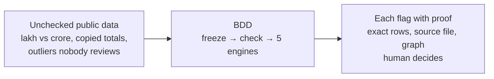

# Bharat Data Detective (BDD)

[](https://github.com/dgexplores/Project-Nirikshan/actions)

**AI forensic layer for Indian public data.** Flags inconsistencies in government datasets for human review — never declares anyone "wrong".

> Built for **UNLEASH LLM, Responsible AI, Rooted in India** (India-First Dataset Track via AIKosh) · Made by **Vaibhava** and **Deepak Gangwar**

---

## Judges — start here (2 minutes)

| | |
|---|---|
| **Live dashboard** | https://web-tau-sandy-60.vercel.app |
| **Demo video (53s)** | [`docs/nirikshan-demo.mp4`](docs/nirikshan-demo.mp4) — narrated walkthrough, real app screens |
| **Run it locally** | `git clone https://github.com/dgexplores/Project-Nirikshan.git && cd Project-Nirikshan && docker compose -f infra/docker/compose.yml up --build` → http://localhost:3000 |

> One honest note: the free API hosting this demo ran on has ended, so the live dashboard shows an offline notice with these same local-run steps. Everything below runs locally in one command — no keys, no paid services.

**Fastest path:** run locally → click **Load demo case** → 6 labelled synthetic datasets → 20 findings, one per engine, in under a second. Then open **Findings** → click any flag → exact rows + lineage graph back to source bytes.

---

## The problem, in one paragraph

Government portals publish enormous data on farmers, crops, schools, pensions — almost none of it gets checked. The same scheme shows different totals on two pages. A unit quietly switches from lakh to crore between releases. Ten articles repeat one number and it looks like ten confirmations when it's one source copied nine times. BDD reads a dataset the way a careful analyst would, and never pretends to know more than the data supports.



Upload any CSV/Excel → frozen with SHA-256 → 5 checks run (**drift, anomaly, contradiction, false consensus, Benford**) → every flag ships with evidence. Core rule: *evidence before narrative — the LLM is a sidekick, never the judge.*

---

## Proof, not claims

| | |
|---|---|
| Forensic engines | 5 (drift, anomaly, contradiction, false consensus, Benford) |
| Real govt datasets ingested | 4, from data.gov.in and nrega.nic.in |
| Real findings from real data | 80 (63 anomaly, 17 Benford), 85 total live |
| Backend tests | **168 passing, 0 failing** (`uv run pytest`) |
| Strongest real finding | **Mohali school enrollment hits 145% of capacity by 2022** (z-score 3.78 vs peers) |
| Ask Detective | Hindi + English, every answer cited `[E1]` or honestly refused |

**The Mohali finding** (Punjab school GER, data.gov.in, straight from the source file):

| Year | Boys | Girls |
|---|---|---|
| 2019 | 105.5 | 112.1 |
| 2022 | **143.2** | **145.1** |

A four-year climb across every school level and gender — likely in-migration outpacing population updates. Worth a human look; the tool only flags, never accuses.

**Try it with real files** — download, drag onto the Datasets page:

| File | What you will see |
|---|---|
| [Punjab school enrollment](https://raw.githubusercontent.com/dgexplores/Project-Nirikshan/main/data/real-samples/punjab-ger-schools-2019-2022/ger_primary_girls_punjab.csv) | The Mohali 145% finding |
| [MGNREGA Punjab FY2024-25, 6,784 rows](https://raw.githubusercontent.com/dgexplores/Project-Nirikshan/main/data/real-samples/mgnrega-punjab-fy2024-25/mgnrega_punjab_fy2024-25.csv) | Anomaly + digit-pattern findings |
| [Wheat APY Punjab vs Haryana](https://raw.githubusercontent.com/dgexplores/Project-Nirikshan/main/data/real-samples/apy-wheat-punjab-haryana/wheat_punjab_apy.csv) | Cross-state compare (gates block bad compares) |
| [Kisan Call Centre sample, 5,000 rows](https://raw.githubusercontent.com/dgexplores/Project-Nirikshan/main/data/real-samples/kcc-punjab-sample/kcc_punjab_sample.csv) | Honest zero — grade A, no forced findings |

All raw files + SHA-256 provenance committed in [`data/real-samples/`](data/real-samples/).

---

## Verify it yourself

```bash
uv run pytest              # 168 tests: engines, API lifecycle, CLI, leakage guard
uv run ruff check .        # lint
cd apps/web && npm run build  # typecheck + production build
```

Scriptable via `bdd` CLI: `bdd ingest`, `bdd findings`, `bdd compare`, `bdd ask "बरेली में कितने लाभार्थी?"`, all `--json`. Blind benchmark runner (`bdd eval`) with explicit denominators — **no accuracy claims until measured** (see `docs/benchmark-protocol.md`).

---

## Honest gaps

| Gap | Plan |
|---|---|
| No seasonal baselines (cyclical spikes flagged) | Trend-aware baselines |
| Tables only, no PDF/policy-text checks | PDF ingestion |
| Keyword search, basic Hindi | Semantic search, full Hindi via Bhashini/Sarvam |
| No logins, jobs die on restart, disk-only storage | Roles, durable queue, cloud storage |

---

## Team

Built by **Vaibhava** and **Deepak Gangwar** for UNLEASH LLM (India-First Dataset Track via AIKosh). MIT (c) 2026 Deepak Gangwar.
