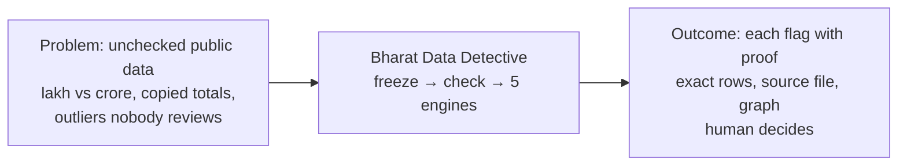
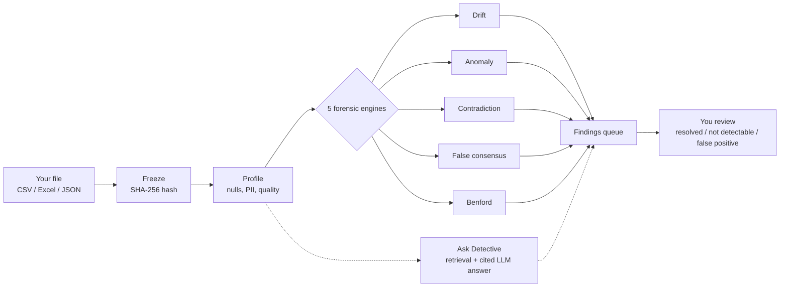

# Bharat Data Detective (BDD)

**AI forensic and evidence-trust layer for Indian public data.** Flags inconsistencies for human review, never declares anyone "wrong".

> Built for **UNLEASH LLM, Responsible AI, Rooted in India** (India-First Dataset Track via AIKosh) · Made by **Vaibhava** and **Deepak Gangwar**

---

## For judges — start here (5 minutes, no install)

| Open this | Link | Do this |
|---|---|---|
| **Live app** | **https://web-tau-sandy-60.vercel.app** | ① Dashboard → ② open a problem → ③ exact rows → ④ pinpoint on graph |
| **API docs (try it live)** | **https://bdd-api.onrender.com/docs** | Expand `POST /compare`, hit Try it out |
| **Sample files to upload** | [Try-it table](#try-it-yourself-with-real-files) | Download a CSV, drag onto Datasets page |

> First click can take ~60 seconds (free server wakes from sleep). Everything below is live and checkable: 18 files, 106 problems, 85 from real data.gov.in datasets.

**Quick test (copy-paste in terminal):**
```bash
curl https://bdd-api.onrender.com/health
# {"status":"ok","service":"bdd-api","version":"1.0.0"}

curl -X POST https://bdd-api.onrender.com/seed/demo -H 'Content-Length: 0'
# seeds 6 demo datasets → 20 findings

curl -X POST https://bdd-api.onrender.com/ask \
 -H 'Content-Type: application/json' \
 -d '{"question":"Bareilly beneficiaries lakh"}' | jq .answer
# → cited answer with [E1] [E2]...
```

### Run it yourself

```bash
git clone https://github.com/dgexplores/bharat-data-detective.git
cd bharat-data-detective && docker compose -f infra/docker/compose.yml up --build
# → Frontend: http://localhost:3000  Backend: http://localhost:8000/docs
```

[](https://github.com/codespaces/new?hide_repo_select=true&ref=main&repo=dgexplores/bharat-data-detective) [](https://vercel.com/new/clone?repository-url=https://github.com/dgexplores/bharat-data-detective&project-name=bharat-data-detective&root-directory=apps/web) [](https://render.com/deploy?repo=https://github.com/dgexplores/bharat-data-detective)

---

## By the numbers

These are live, checkable facts, not marketing claims. Every figure below is either a running test count, a live API response, or a number sitting in the repo right now.

| | |
|---|---|
| Forensic engines | 5 (drift, anomaly, contradiction, false consensus, Benford) |
| Real government datasets ingested | 4, from data.gov.in, desagri/APY and nrega.nic.in |
| Real findings from real data, live right now | 85 (66 anomaly, 16 Benford, 3 contradiction), out of 106 total |
| Backend tests passing | 168, zero failures |
| Strongest real finding | SAS Nagar (Mohali) district's school enrollment ratio hits 145% of capacity by 2022, z-score 3.78 against its peers |
| Languages Ask Detective answers in | Hindi and English, both cited |

---

## What this is

Government portals in India publish enormous amounts of data on farmers, crops, schools, pensions. Nobody has time to check it by hand, so most of it goes unchecked. The same scheme sometimes shows different totals on two different pages. A unit quietly switches from lakh to crore between one year's release and the next. Ten articles repeat one number, and it looks like ten confirmations when it's really one source copied nine times.

BDD reads a dataset the way a careful analyst would, and it never pretends to know more than the data supports.



1. You upload any CSV or Excel file, or point it at a real dataset from data.gov.in / AIKosh.
2. It freezes the file with a SHA-256 hash so it can never be silently changed later, checks its quality, and works out what each column actually means (in Hindi and English: lakh/लाख, crore/करोड़, FY 2024-25).
3. Five checks run against it: has the **definition drifted**? Is there an **anomaly**? Do **two sources contradict** each other? Is this **false consensus** (many "sources," one origin)? Do the digits fail a **Benford** check?
4. Every flag comes with the evidence, the exact source row, and a lineage graph back to the original bytes. You decide what it means, the tool never does.

> Core rule: evidence before narrative. The LLM is a sidekick here, never the judge.

---

## Features

**For anyone:**
- **Drag-drop ingest**, CSV/TSV/XLSX/JSON/Parquet, live progress, fitness grade A-F
- **Auto profile**, nulls, duplicates, distributions, PII hints (Aadhaar/PAN/mobile flagged)
- **Lineage graph**, click any finding to see raw file to parser to rule to finding (animated SVG)
- **Findings queue**, filter by severity/engine, one-click reviewer decision (resolved / false-positive)

**For analysts:**
- **Compare any two datasets**, gates check geography/period/unit/definition before numbers are compared (lakh vs crore is blocked, not silently compared)
- **Benford screening**, digit pattern vs natural law (MAD score) to spot fabricated-looking amounts
- **False consensus**, 2 "sources" tracing to 1 origin is reported as diversity 0.5, not 2 confirmations
- **Fuzzy geo match**, "Adabari T.E." matches "Adabari" (RapidFuzz) so spelling doesn't block valid compares

**For AI and India-first work:**
- **Ask Detective**, ask in Hindi or English ("बरेली में कितने लाभार्थी?"), get a cited answer `[E1]` or an honest refusal if evidence is thin
- **Responsible AI in practice**: PII redacted before any LLM call, prompt-injection blocked, hallucination flagged, every label access logged
- **India datasets ready**: real GER, MGNREGA, and Kisan Call Centre data from data.gov.in (see Real data proof below), plus Pincode Directory and Crop Production demo fixtures, all frozen with manifests

**For developers:**
- **`bdd` CLI**, `bdd seed`, `bdd ingest`, `bdd findings`, `bdd compare`, `bdd ask`, `bdd summary`, all `--json` scriptable
- **`bdd eval`**, blind benchmark runner: run without labels, adjudicate, report with explicit denominators (no fake accuracy)

---

## What BDD can do today

**You can use it right now for real work:**

| Capability | What happens | Try it |
|---|---|---|
| **Upload any Indian dataset** | Drag-drop CSV/Excel/JSON → frozen with SHA256 hash, never lost | `Datasets` page or `bdd ingest` |
| **Auto-check quality** | Shows nulls, duplicates, PII (Aadhaar/PAN), fitness grade A-F | Open any dataset → `Profile` tab |
| **Catch 5 forensic patterns** | Drift (lakh→crore), spike (5k vs 1k), contradiction (2 sources differ), false consensus (1 source copied), Benford digit check | `Findings` queue |
| **See proof for every flag** | Click finding → evidence row + lineage graph `raw → parser → rule → finding` | `Findings → View lineage` |
| **Compare 2 datasets safely** | Checks geography/period/unit *before* comparing numbers (blocks bad compares) | `Compare` page |
| **Ask in Hindi/English** | `बरेली में कितने लाभार्थी?` → cited answer `[E1]` or honest refusal | `Ask Detective` or `bdd ask` |
| **Work offline or with AI** | Deterministic cited answers always; add Sarvam/BharatGen key to get LLM hypotheses (still cited) | `POST /ask` |
| **Script everything** | `bdd` CLI + API + blind benchmark runner (`bdd eval`) with explicit denominators | `bdd summary`, `bdd eval run` |
| **Deploy free** | SQLite locally, or Postgres on Render's free tier with the frontend on Vercel free | `docker compose up` |

**Live proof:** click "Load demo case" on the deployed frontend and it seeds 6 clearly-labelled synthetic datasets (micro-irrigation unit drift, a planted district spike, two conflicting PM-KISAN-style totals, and a fabricated-looking payments file) → 20 findings, one of each engine, in under a second. Open https://web-tau-sandy-60.vercel.app and click `Findings`.

### Try it yourself with real files

Download, then drag onto the Datasets page:

| File | What you will see | Download |
|---|---|---|
| Punjab school enrollment, Primary Girls (data.gov.in) | The Mohali 145% finding: exact rows, graph pinpoint | [ger_primary_girls_punjab.csv](https://raw.githubusercontent.com/dgexplores/bharat-data-detective/main/data/real-samples/punjab-ger-schools-2019-2022/ger_primary_girls_punjab.csv) |
| MGNREGA Punjab FY2024-25, 6,784 rows (nrega.nic.in) | Anomaly + digit-pattern findings | [mgnrega_punjab_fy2024-25.csv](https://raw.githubusercontent.com/dgexplores/bharat-data-detective/main/data/real-samples/mgnrega-punjab-fy2024-25/mgnrega_punjab_fy2024-25.csv) |
| Wheat APY Punjab vs Haryana (DES Agri via data.gov.in) | Cross-state compare: gates correctly block different districts | [wheat_punjab_apy.csv](https://raw.githubusercontent.com/dgexplores/bharat-data-detective/main/data/real-samples/apy-wheat-punjab-haryana/wheat_punjab_apy.csv) |
| Kisan Call Centre sample, 5,000 rows (data.gov.in API) | Honest zero: grade A, no forced findings | [kcc_punjab_sample.csv](https://raw.githubusercontent.com/dgexplores/bharat-data-detective/main/data/real-samples/kcc-punjab-sample/kcc_punjab_sample.csv) |

**Real government data, not just synthetic fixtures, with a real finding in it:**
The raw files for all three datasets below, along with full source-URL and SHA-256 provenance for every one, are committed in [`data/real-samples/`](data/real-samples/) and [`data/source-register.csv`](data/source-register.csv), not just described here.

- **District-wise Gross Enrollment Ratio (GER) in Schools, Punjab, 2019-2022**, downloaded directly from **data.gov.in** ([catalog page](https://www.data.gov.in/catalog/district-wise-gross-enrollment-ratio-ger-schools-punjab)), all 8 official resources (Primary/Upper Primary/Secondary/Higher Secondary x Boys/Girls), each ingested and profiled with its own resource-id provenance. The anomaly engine surfaced a genuine, consistent pattern: **SAS Nagar (Mohali) district's GER climbs to 124-145% by 2022, far above every peer district, z-score 3.78, high confidence, and it shows up across almost every school level and gender**, not a one-off glitch in a single column. This is BDD flagging something worth checking in the exact platform this track is built around, not a synthetic demo.

  The raw numbers, straight from the source file, for SAS Nagar's enrollment ratio in Primary schools:

  | Year | Boys | Girls |
  |---|---|---|
  | 2019 | 105.5 | 112.1 |
  | 2020 | 114.8 | 124.4 |
  | 2021 | 118.5 | 128.5 |
  | 2022 | **143.2** | **145.1** |

  A four-year climb, not a single bad row, which is exactly why it's worth a human looking at it: likely Mohali's rapid in-migration outpacing how its official school-age population gets updated, not necessarily anything wrong.
- **MGNREGA Punjab district-wise FY2024-25** (6,784 rows, sourced from the official [nrega.nic.in](https://nrega.nic.in) release via a public GitHub mirror) has been ingested end-to-end, profiled, scored, and run through the anomaly engine, with real findings visible in the `Findings` queue after `bdd ingest`.
- **Kisan Call Centre farmer queries, Punjab** (5,000-row real sample pulled directly from data.gov.in's own Open Government Data API, out of a live 47.9-million-row dataset) has also been ingested and profiled (fitness 98.9, grade A). It correctly produces **zero** anomaly findings, because it has no numeric metric column to check, only a call id and a calendar day/month, and forcing a statistical check on those would be a fabricated finding, not a real one. Pulling this dataset in is what surfaced and fixed a real bug: the engines used to treat any numeric column as a metric, so they confidently flagged the call ids and calendar days as "anomalies" until this was caught and corrected. The rule now lives once, as `ColumnProfile.is_metric` in `packages/contracts/src/bdd_contracts/profile.py`, and the anomaly engine, the fitness score and the definition-card inference all share it. It had been fixed in the anomaly engine alone at first, which left the same false positives in three more places: `fitness.py` (an id column's zero variance dragged down the data-quality score), `definitions.py` (a unit and denominator were invented for a call id), and the Compare page in the web app, which re-implemented the rule in TypeScript and so still offered call ids and calendar parts as comparable metrics. `is_metric` is now a serialised computed field, so the browser reads the same rule the backend applies instead of deriving its own.

All of the above is already ingested and live on the deployed demo, not just local. Reproduce any of it yourself with the `bdd` CLI, see [`data/real-samples/README.md`](data/real-samples/README.md) for the exact commands.

---

## Honest gaps, what isn't built yet

**These are real limitations today, the roadmap below tracks how we fix them:**

| Gap | Why it matters | How we will fix it |
|---|---|---|
| **No seasonal baseline** | Normal seasonal spikes get flagged as anomalies | Smarter trend-aware baselines |
| **No PDF checks** | Only tables checked, not scheme PDFs/policy text | Read PDFs as well as tables |
| **Basic search** | Question matching is keyword-based, not semantic | Meaning-based search over evidence |
| **Hindi is basic** | Only common Hindi words map to English; free phrasing may miss | Full Hindi understanding via Bhashini/Sarvam |
| **No login / roles** | Anyone can review (an optional shared API key exists, no user accounts) | Accounts with reviewer/admin roles |
| **Jobs die on restart** | Interrupted jobs are marked failed with a retry note, but must be resubmitted by hand | A job queue that survives restarts with retries |
| **No cloud storage** | Raw files live on the server disk | Cloud object storage |
| **No DB migrations** | Tables are created fresh, not versioned | Versioned database upgrades |
| **No auto-monitor** | Must re-upload when a portal updates numbers | Scheduled re-checks with alerts |
| **No PDF case export** | Can't share a case file externally yet | One-click PDF export |

> **No fake accuracy:** we report no precision/recall until the blind CAG benchmark is run via `bdd eval`. Transparency over hype, see `docs/benchmark-protocol.md`.

---

## How it works



**Deterministic:** same bytes always produce the same hashes and the same findings, reruns are idempotent and regression-tested.  
**Immutable:** the raw store is never overwritten, every manifest pins the parser version and config hash used.  
**Governed:** benchmark labels in `data/benchmark-restricted/` are never indexed, a CI leakage test fails the build if they ever leak.

---

## Quickstart

Requirements: [uv](https://docs.astral.sh/uv/) (Python >= 3.12), Node >= 20, Docker optional.

### One command each (local dev)

```bash
# Terminal 1: API on :8000 (SQLite, zero external services)
uv sync
uv run uvicorn bdd_api.main:app --app-dir services/api/src --port 8000

# Terminal 2: Dashboard on :3000 (proxies /api/backend -> :8000)
cd apps/web && npm install && npm run dev
```

Then open http://localhost:3000 and click **Load demo case** to seed a full synthetic forensic corpus (drift + anomaly + contradiction + false-consensus + Benford demos) in one click.

### Full stack via Docker

```bash
docker compose -f infra/docker/compose.yml up --build
# web: http://localhost:3000   api: http://localhost:8000/docs   db: Postgres+PostGIS
```

### Permanent free-tier deploy (1-click)

**Render (backend+DB+frontend, free):** `render.yaml` blueprint → https://dashboard.render.com/blueprint → select repo → Apply  
**Vercel (frontend, free Hobby):** `cd apps/web && vercel --prod --yes` (already live at https://web-tau-sandy-60.vercel.app)  
**Supabase (DB, free 500MB):** `supabase projects create bharat-db --region ap-south-1`

No paid APIs needed (`LLM_PROVIDER=mock` deterministic, TF-IDF fallback if Qdrant not set).

### Verify

```bash
uv run pytest        # 168 tests incl. API lifecycle, engines, CLI, leakage guard
uv run ruff check .  # lint
cd apps/web && npm run build  # typecheck + production build
```

---

## Command line

Everything is scriptable via the `bdd` command (installed by `uv sync`):

```bash
uv run bdd init                          # create dirs + database
uv run bdd seed --reset                  # fresh synthetic demo corpus
uv run bdd serve --port 8000             # start the HTTP API

uv run bdd ingest data.csv --source-id SRC-MGN-01 --release-date "FY 2024-25"
uv run bdd artifacts                     # ids, hashes, fitness grades
uv run bdd show art-demo-benford         # overview (or --manifest/--profile/--fitness/--lineage)

uv run bdd findings                      # open review queue (default)
uv run bdd findings --kind benford --severity high
uv run bdd finding <id>                  # full JSON payload
uv run bdd review <id> --status resolved --note "verified against origin"

uv run bdd compare art-a beneficiaries_lakh art-b beneficiaries_crore
uv run bdd ask "any outliers in tube wells?" --artifact art-demo-irr-anomaly
uv run bdd summary                       # corpus + queue statistics

# Blind benchmark (restricted, governed)
uv run bdd eval run
uv run bdd eval adjudicate <run_id> <case> --decision detected --findings <id>
uv run bdd eval report <run_id>
```

Every list command accepts `--json` for scripting/cron use.

---

## Signature innovations

1. **Semantic Drift Detection** - versions definitions, units, denominators and boundaries; a numerical change is not comparable until the concept behind it is checked. Drift scored by semantic impact, not string diff.
2. **Evidence Lineage Graph** - every displayed claim traces back through parser → profile → rule → raw evidence, rendered as a graph per artifact.
3. **False Consensus Detection** - several pages repeating a number are not independent confirmation if they trace to the same origin. BDD reports evidence diversity, not raw source count.
4. **Cross-source AI Forensics** - staged comparison: deterministic alignment gates first, then numeric reconciliation; LLM only ever summarizes bounded, cited excerpts and never calculates facts or picks a "true" source.

---

## Engineering guarantees

- **Deterministic findings**: identical inputs → identical finding ids (hash-derived); reruns are idempotent.
- **Immutable artifacts**: freeze-without-overwrite raw store; manifests pin parser version + config hash.
- **Robust API surface**: consistent `{error:{code,message,request_id}}` envelope, request-id middleware, structured JSON logs, upload size/format guards, gzip, CORS allow-list, graceful job failure surfacing step-by-step.
- **Persistence**: SQLAlchemy dual-mode - SQLite out of the box, `BDD_DATABASE_URL=postgresql+psycopg://…` for production (compose ships Postgres).
- **Governance**: reviewer decisions are first-class rows; benchmark labels are quarantined in `data/benchmark-restricted/` and a CI leakage test fails any label string that reaches app code or fixtures.
- **CI**: ruff + pytest (SQLite + Postgres) + docker image builds on every PR.

---

## Configuration

All knobs are `BDD_`-prefixed env vars (see `.env.example`):

| Variable | Default | Purpose |
|---|---|---|
| `BDD_DATABASE_URL` | `sqlite:///data/bdd.db` | SQLite or Postgres (`postgresql+psycopg://`) |
| `BDD_RAW_STORE` / `BDD_MANIFEST_DIR` | `data/raw` / `data/manifests` | Immutable stores |
| `BDD_MAX_UPLOAD_MB` | `200` | Ingest size guard |
| `BDD_CORS_ORIGINS` | `http://localhost:3000` | Comma-separated origins |
| `BDD_LLM_BASE_URL` / `BDD_LLM_API_KEY` / `BDD_LLM_MODEL` | empty | Optional OpenAI-compatible endpoint for Ask Detective synthesis |

Ask Detective runs fully offline in deterministic cited-synthesis mode when no LLM is configured. It has also been verified end-to-end against a local open-source model (Ollama running `qwen2.5:3b`, `BDD_LLM_BASE_URL=http://localhost:11434/v1`), answering both English and Hindi questions with citations intact and refusing when evidence is thin.

---

## Repository layout

```
apps/web/                  # Next.js 15 + TS + Tailwind + framer-motion dashboard
services/api/              # FastAPI: routers, jobs, pipelines, ask service, seed
packages/contracts/        # shared Pydantic v2 schemas (manifests, findings, lineage…)
pipelines/ingestion/       # parsers (CSV/TSV/XLSX/JSON/JSONL/Parquet), manifests, CLI
pipelines/forensics/       # profiler, normalize, drift, anomaly, comparability,
                           # cross-source, fitness, lineage, false-consensus, definitions
pipelines/evaluation/      # blind benchmark runner (restricted)
rag/                       # India geo aliases, retrieval + LLM client (lineage
                           # and false-consensus logic live in pipelines/forensics/)
data/fixtures/public/      # synthetic demo fixtures generated by seed
data/benchmark-restricted/ # CAG case registry (isolated, never loaded at runtime)
docs/                      # specification, ADRs, benchmark protocol, UNLEASH report
infra/docker/              # Dockerfiles + compose (api, web, postgres)
tests/                     # unit + API lifecycle + seed + leakage guard
```

---

## The demo case (synthetic, reproducible)

`POST /seed/demo` writes six byte-stable CSV fixtures and runs the full stack:

1. Two micro-irrigation annual releases reporting beneficiaries in **lakh** then **crore** → unit/definition/scope **semantic drift**, gated `not_comparable`.
2. A district irrigation table with a planted reporting spike → **anomaly** findings (IQR).
3. Scheme payments with uniform leading digits → **Benford** nonconformity (MAD 0.056).
4. Two "sources" quoting one scheme total, where the digest derives from the release → **cross-source conflict** plus a **false-consensus** finding (diversity ratio 0.5).

Everything above is marked synthetic in source ids/titles. No real-world accusations; no benchmark labels.

---

## Validation strategy

BDD is evaluated against independently verified historical findings from CAG reports used as a **hidden benchmark** (register → map → freeze → blind run → adjudicate → measure). See `docs/benchmark-protocol.md`. A "not detectable" outcome is a finding, not a failure: it documents a data-access or observability gap. No performance claims until measured.

**Try the blind runner now:**
```bash
uv run bdd eval run
uv run bdd eval adjudicate <run_id> BDD-001 --decision not_detectable
uv run bdd eval report <run_id>
```

---

## Governance rules (mandatory)

- No raw source replacement: add a versioned artifact + supersession link.
- Benchmark labels never enter app seed data, retrieval index, prompts or logs (enforced by `tests/test_leakage.py`).
- Every displayed finding carries at least one evidence link and one provenance record; high/critical findings need human confirmation before external sharing.
- Secrets never committed; `.env.example` placeholders only.

---

## Documents

- `docs/specification/*.docx`, implementation blueprint plus deliverables pack
- `docs/benchmark-protocol.md`, blinded CAG evaluation protocol
- `docs/adr/ADR-0001-repository-layout.md`
- `docs/UI_Finish_Gate_Report.md`
- `docs/PROTOTYPE_VIDEO_SCRIPT.md`, UNLEASH prototype video walkthrough script
- [`docs/PROJECT_STATUS.md`](docs/PROJECT_STATUS.md), what is built, what is still open, and the commands to pick each open item back up

---

## Status

Launch-ready v1.3: v1.0 platform + Benford screening + fuzzy geo resolution + `bdd` CLI + blind benchmark evaluation runner (see Roadmap for the ledger).

For the current build state, what is deployed versus what is only on `main`, and the exact steps remaining, see [`docs/PROJECT_STATUS.md`](docs/PROJECT_STATUS.md).

---

## Roadmap

### Done

- Immutable file freeze (SHA-256), quality profiler with PII hints, A–F fitness score
- Five forensic engines: anomaly, definition drift, cross-source contradiction, false consensus, Benford digit screening
- Comparability gates (place, time, unit, meaning) before any comparison; fuzzy place-name matching
- Evidence lineage graph, reviewer decisions, Hindi/English cited Q&A with safety gates, scriptable `bdd` CLI, blind benchmark runner
- 168 tests green, lint + production build clean, Docker images built on every change

### Next

- Seasonal baselines (fewer false alarms on cyclical data), full Hindi understanding, PDF/policy-document checks
- Logins with reviewer roles, jobs that survive restarts, cloud file storage
- Scheduled monitors that catch portals silently revising numbers, one-click PDF case export

> No accuracy claims until the blinded CAG benchmark produces measured numbers.

---

## Team

Built by **Vaibhava** and **Deepak Gangwar** for UNLEASH LLM (India-First Dataset Track via AIKosh).

## License

MIT (c) 2026 Deepak Gangwar
